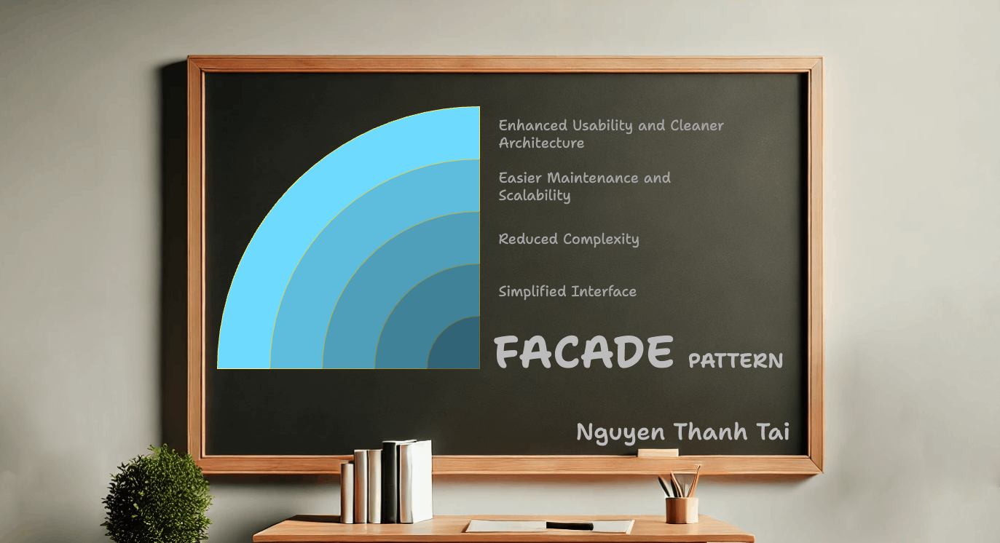
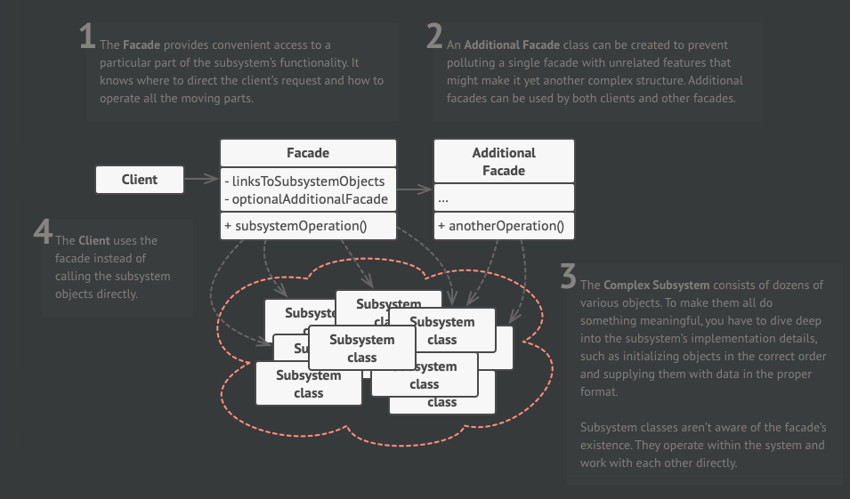

Chào mừng anh em trở lại với
series [Design Pattern thực chiến](https://viblo.asia/s/design-pattern-thuc-chien-0gdJzpPnVz5) trong lập trình hướng đối
tượng.
Khi thiết kế các hệ thống phức tạp, một trong những thách thức lớn nhất là độ phức tạp và giữ cho hệ thống dễ bảo trì, mở rộng.
**Facade Pattern** là một trong những giải pháp giúp giải quyết vấn đề trên.
Nó giúp đơn giản hóa tương tác với hệ thống phức tạp bằng cách cung cấp một interface đơn giản,
từ đó làm cho code dễ đọc và bảo trì hơn. Tuy nhiên, việc lạm dụng **Facade pattern** cũng nảy sinh các vấn đề mới.\
Vậy sử dụng Facade sao cho đúng và đủ, anh em hãy cùng tôi tìm hiểu qua bài viết này

# I. Khái niệm và kiến trúc
## 1. Định nghĩa
**Facade pattern** cung cấp một interface đơn giản và dễ sử dụng cho một hệ thống con phức tạp hoặc một nhóm các class có mối quan hệ với nhau.

Ví dụ quá trình thanh toán QR hiện nay cực kỳ đơn giản, nhưng đấy chỉ được xem là Facade của hệ thống thanh toán.
Phía sau nó là hàng ngàn xử lý phức tạp tương ứng với mỗi giao dịch.
Do đó, có thể nói Facade không thực sự loại bỏ sự phức tạp bên trong hệ thống, mà chỉ che giấu nó dưới một interface duy nhất.

> **Facade** dịch sang tiếng Việt có nghĩa là "mặt tiền"\
> Khi nhắc đến Facade, anh em hãy nhớ đến cụm từ **Simplified Interface**

**Nhóm: Structural patterns**

## 2. Problem
Trong các hệ thống lớn, một hệ thống con hoặc một tập hợp các class thường phức tạp với rất nhiều thành phần và
quy tắc nghiệp vụ. Điều này dẫn đến việc anh em phải tương tác với rất nhiều class, theo thời gian code trở nên khó đọc, khó bảo trì, khó nâng cấp và mở rộng.

## 3. Intent (Mục đích)
Trích từ cuốn **Design patterns Elements of Reusable Object-Oriented Software**
> Provide a unified interface to a set of interfaces in a subsystem. Facade defines a higher-level
> interface that makes the subsystem easier to use.
>
> **GoF**

**Facade Pattern** đưa ra một interface chung để giao tiếp với hệ thống con, đồng thời che giấu sự phức tạp của hệ thống theo góc nhìn của client.\
Các lợi ích khi sử dụng Facade bao gồm

- Che giấu sự phức tạp của hệ thống con.
- Giảm thiểu sự phụ thuộc client và các thành phần phía sau Facade.
- Dễ bảo trì, dễ mở rộng hơn.

## 4. Structure (Cấu trúc)



**Facade**\
Cung cấp interface đơn giản cho hệ thống con.

**Additional Facade**\
Facade có thể có các facade con để đảm bảo facade cha không trở thành một nồi lẩu thập cẩm

**Subsystem Classes**\
Các class phức tạp bên trong hệ thống mà Facade tương tác.
Các class này thực hiện các chức năng riêng nhưng thực tế client không cần biết chi tiết.

## 5. Ứng dụng
**Facade Pattern** thường được sử dụng trong các trường hợp sau:
- Khi anh em có một hệ thống con phức tạp và muốn cung cấp một giao diện đơn giản hơn để client sử dụng mà không cần quan
tâm đến chi tiết bên trong.
- Sử dụng rộng rãi trong các thư viện hoặc framework lớn.
- Giảm sự phụ thuộc giữa hệ thống con và các class khác trong ứng dụng.
- Trong mô hình 3 layers, tầng **Service** có thể được xem như một Facade.\
Layer này cung cấp giao diện đơn giản cho tầng **Presentation** tương tác, đồng thời xử lý logic nghiệp vụ phức tạp bên dưới mà **Presentation** không cần phải nắm rõ.
## 6. Pitfall

**Lạm dụng Facade**\
Nếu không bố trí hợp lý, Facade sẽ trở thành trại tị nạn của các class, class nào mới tạo cũng được ném vào facade khiến cho facade trở nên cồng kềnh khó bảo trì.\
Việc sử dụng quá nhiều Facade cũng có thể làm mất đi sự linh hoạt khi cần access trực tiếp vào hệ thống con.\
Nên phân bổ các class một cách hợp lý vào các facade, những class nào cần access trực tiếp không nên đưa vào facade.

**Thiếu tính mở rộng**\
Nếu không thiết kế cẩn thận, Facade có thể làm giảm khả năng mở rộng của hệ thống.
Mỗi khi cần thêm chức năng mới, anh em có thể phải thay đổi giao diện của Facade.

# II. Các ứng dụng trong các thư viện lớn của Java
Trong Java, Facade Pattern được ứng dụng rộng rãi trong nhiều thư viện và framework. Một số ví dụ tiêu biểu bao gồm:

**Java Database Connectivity (JDBC)**\
JDBC cung cấp một giao diện đơn giản để làm việc với cơ sở dữ liệu, che giấu đi sự
phức tạp của các API liên quan đến kết nối, truy vấn và quản lý dữ liệu.

**Spring Framework**\
Spring sử dụng Facade Pattern để cung cấp các API dễ sử dụng cho các chức năng phức tạp như AOP, Dependency Injection, và Transaction Management.

# III. Thực hành implement trong Java
Trong ví dụ này tôi đơn giản hoá 2 subsystem A và B. Sử dụng một `Facade` để che giấu sự phức tạp khi `client` (Main) muốn thực hiện `operation`

**Subsystem A**
```java
class SubsystemA {
  public void operationA() {
    System.out.println("Operation A");
  }
}
```

**Subsystem B**
```java
class SubsystemB {
  public void operationB() {
    System.out.println("Operation B");
  }
}
```

**Facade**\
Chỉ `Facade` khai báo `public` modifier và cùng `package` với `SubsystemA` và `SubsystemB`.\
Đồng nghĩa với việc `Main` không thể access trực tiếp A và B, mà chỉ có thể tương tác với các interface `Facade`
```java
public class Facade {
    private final SubsystemA subsystemA;
    private final SubsystemB subsystemB;

    public Facade() {
        subsystemA = new SubsystemA();
        subsystemB = new SubsystemB();
    }

    public void operation() {
        subsystemA.operationA();
        subsystemB.operationB();
    }
}
```

**Main | Client**
```java
public class App
{
  public static void main( String[] args )
  {
    Facade facade = new Facade();
    facade.operation();
  }
}
```

**Output**

```
Operation A
Operation B
```

Full code anh em có thể tham khảo ở
đây: [design-pattern-made-easy/facade](https://github.com/nguyentaijs/design-pattern-made-easy/tree/main/facade/src/main/java/io/github/nguyentaijs/subsystems)

# IV. Lời kết
**Facade Pattern** là một giải pháp hữu ích để giảm sự phức tạp của các hệ thống lớn. Cung cấp
một giao diện đơn giản để tương tác với hệ thống con phức tạp, Facade giúp cải thiện khả năng bảo trì và mở rộng của hệ
thống. Tuy nhiên, cần sử dụng nó một cách cẩn thận để tránh tạo thêm sự phức tạp không cần thiết.

Được ứng dụng rộng rãi trong các thư viện lớn như JDBC, JSF và Spring, Facade Pattern đã chứng minh giá
trị của mình trong việc giúp dev làm việc với các hệ thống phức tạp một cách dễ dàng hơn.

Hẹn anh em ở các bài viết tiếp theo~

# V. Tài liệu tham khảo

1. [Refactoring.guru](https://refactoring.guru/design-patterns)
2. Head first design pattern - O'Reilly
3. Design patterns Elements of Reusable Object-Oriented Software - GoF

-----

Nếu anh em cảm thấy bài viết hữu ích đừng ngần ngại click upvote cho bài viết, hoặc phát hiện ý nào chưa hợp lý hoặc cần
giải thích thêm hãy comment cho tôi biết để cùng trao đổi nhé.
Anh em có thể tham khảo các bài viết khác của tôi tại [Blog cái nhân](https://nguyentaijs.github.io/) hoặc kết nối với
tôi qua [Linkedin](https://www.linkedin.com/in/nguyentaijs)
