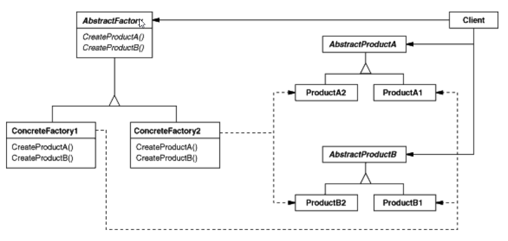
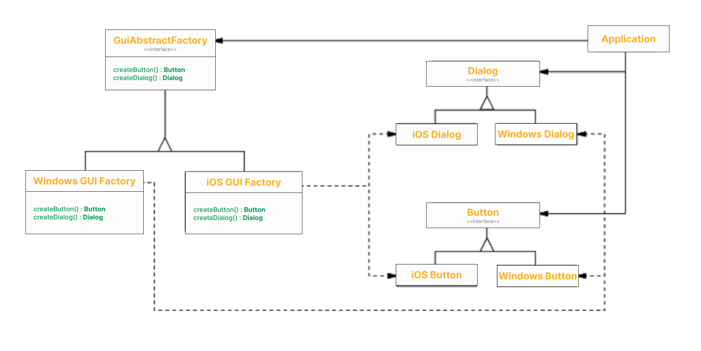

Ở bài viết trước, chúng ta đã cùng nhau tìm hiểu về [Factory Method](https://viblo.asia/p/design-pattern-vao-thu-vien-tim-factory-method-y3RL1PyPJao) và cách nó giúp đơn giản hóa việc khởi tạo các đối tượng trong các hệ thống phức tạp.
Tiếp nối series [Design Pattern thực chiến](https://viblo.asia/s/design-pattern-thuc-chien-0gdJzpPnVz5), bài viết này sẽ đưa bạn đến với một design pattern khác cũng không kém phần quan trọng và phổ biến trong lập trình hướng đối tượng: **Abstract Factory**.

# I. Khái niệm và kiến trúc
Trích từ cuốn **Design patterns Elements of Reusable Object-Oriented Software**
> Provide an interface for creating families of related or dependent objects without
specifying their concrete classes.
>
> **GoF**

Mục tiêu hướng tới của pattern này là tạo ra một interface cung cấp chức năng tạo một vài **họ (families**) của các đối tượng có liên quan đến nhau.
được sử dụng để tạo ra các họ đối tượng có liên quan với nhau mà không cần chỉ định lớp cụ thể.
Trong bài viết này, chúng ta sẽ khám phá cách implement pattern này bằng Java thuần và cả Spring, từ đó giúp bạn nắm rõ sự khác biệt giữa hai cách tiếp cận và lợi ích của từng phương pháp.

**Structure tổng quát**



# II. Thực hành implement abstract factory

## 1. Yêu cầu bài toán

**Phát triển phần mềm mô phỏng giao diện người dùng (GUI - Graphic User Interface) cho cả iOS và Windows**

Trong phiên bản đầu tiên, giao diện được thiết kế đơn giản với hai thành phần cơ bản: dialog và button.

Khi ứng dụng được khởi tạo, người dùng có thể `render` một dialog và cho phép nó `show` trên màn hình.\
Đối với button, người dùng có thể `render` và `click` button đó.\
Tương lai yêu cầu có thể mở rộng ra xây dựng GUI hỗ trợ các OS và thiết bị khác như android.

## 2. Phân tích yêu cầu
Trong bài toán này, chúng ta cần phát triển một phần mềm mô phỏng giao diện người dùng (GUI - Graphic User Interface) cho cả hai hệ điều hành là iOS và Windows. Giao diện ban đầu được thiết kế đơn giản với hai thành phần chính: Dialog và Button.

**Families (Họ đối tượng)**: Ở đây, chúng ta có hai họ đối tượng chính là iOS và Windows. Đây là dấu hiệu đầu tiên cho thấy sự phù hợp của Abstract Factory. Mỗi họ đối tượng sẽ có các phiên bản cụ thể của Dialog và Button tương ứng.

**Application**: Là thành phần chịu trách nhiệm quản lý các tương tác của người dùng. Đây cũng là nơi chứa các Dialog và Button được khởi tạo từ các factory tương ứng.

**Dialog**: Đối với Dialog, chúng ta có hai phương thức cần triển khai: render() để khởi tạo giao diện và show() để hiển thị Dialog lên màn hình.

**Button**: Tương tự, Button cũng có hai phương thức: render() để khởi tạo và click() để xử lý sự kiện khi người dùng nhấp vào button.

Cuối cùng, chúng ta sẽ sử dụng **Abstract Factory** để khởi tạo các đối tượng của Application tùy thuộc vào hệ điều hành của hệ thống.
Dễ thấy cách làm này giúp đảm bảo tính linh hoạt và dễ dàng mở rộng khi có nhu cầu hỗ trợ thêm các hệ điều hành hoặc thiết bị khác trong tương lai, chẳng hạn như Android

## 3. Mapping


## 4. Implement sử dụng Java
**Dialog | Product**
```java
public interface Dialog {
    void show();
    void render();
}
```

**iOS Dialog | Concrete product**
```java
public class IosDialog implements Dialog {
  @Override
  public void show() {
    System.out.println("iOS dialog shown");
  }
  @Override
  public void render() {
    System.out.println("iOS dialog rendered");
  }
}
```

**Windows Dialog | Concrete product**
```java
public class WindowsDialog implements Dialog {
  @Override
  public void show() {
    System.out.println("Windows dialog shown");
  }
  @Override
  public void render() {
    System.out.println("Windows dialog rendered");
  }
}
```

**Button | Product**
```java
public interface Button {
  void render();
  void click();
}
```

**iOS Button | Concrete product**
```java
public class IosButton implements Button {
  @Override
  public void render() {
    System.out.println("iOS button rendered");
  }

  @Override
  public void click() {
    System.out.println("iOS button clicked");

  }
}
```

**Windows Button | Concrete product**
```java
public class WindowsButton implements Button {
  @Override
  public void render() {
    System.out.println("Windows button rendered");
  }

  @Override
  public void click() {
    System.out.println("Windows button clicked");
  }
}
```

**GUI Abstract factory | Abstract factory**
```java
public interface GuiAbstractFactory {
  Dialog createDialog();
  Button createButton();
}
```

**Windows factory | Concrete Factory**
```java
public class WindowsGuiFactory implements GuiAbstractFactory {
  @Override
  public Dialog createDialog() {
    return new WindowsDialog();
  }

  @Override
  public Button createButton() {

    return new WindowsButton();
  }
}
```

**iOS factory | Concrete Factory**
```java
public class IosGuiFactory implements GuiAbstractFactory {
  @Override
  public Dialog createDialog() {
    return new IosDialog();
  }

  @Override
  public Button createButton() {
    return new IosButton();
  }
}
```

**Application | Client**
```java
public class Application {
  private Button button;
  private Dialog dialog;

  public Application(GuiAbstractFactory factory) {
    button = factory.createButton();
    dialog = factory.createDialog();
  }

  public void render() {
    dialog.render();
    button.render();
    System.out.println("Finish rendering");
    System.out.println("===");
  }

  public void interact() {
    dialog.show();
    button.click();
    System.out.println("Finish interacting");
    System.out.println("===");
  }
}
```

**Main | Runner**
```java
public class App {
  public static final String OS_WIN = "win";
  public static final String OS_MAC = "mac";

  public static void main(String[] args) {
    Application application;
    String os = System.getProperty("os.name").toLowerCase();
    if (os.contains(OS_WIN)) {
      application = new Application(new WindowsGuiFactory());
    } else if (os.contains(OS_MAC)) {
      application = new Application(new IosGuiFactory());
    } else {
      System.err.println("Can not recognize os.");
      return;
    }

    application.render();
    application.interact();
  }
}
```

**Output | Current OS = Windows**
```
Windows dialog rendered
Windows button rendered
Finish rendering
===
Windows dialog shown
Windows button clicked
Finish interacting
===
```

Full code anh em có thể tham khảo ở đây: [design-pattern-made-easy/tree/main/abstract-factory](https://github.com/nguyentaijs/design-pattern-made-easy/tree/main/abstract-factory)

## 5. Implement sử dụng Spring
Để tận dụng sức mạnh của Spring IoC, anh em phải cải biên diagram một chút.
Thêm một class nữa đóng vai trò làm đối tượng quản lý Factory nào sẽ được lựa chọn, tôi gọi class này là `GuiFactoryBeanManager`.\
Component này nắm giữ danh sách các bean có chung interface `GuiAbstractFactory` được quản lý bởi Spring IoC, khi gọi method `getInstance()` sẽ trả về factory tương ứng với OS của hệ thống.

> Đây không phải là cách duy nhất để implement abstract factory trong Spring, nếu anh em có cách nào hay hơn hãy comment để bổ sung thêm

**GuiFactoryBeanManager | Abstract Factory manager**
```java
public GuiAbstractFactory getInstance() throws Exception {
  String os = System.getProperty("os.name").toLowerCase();
  if (os.contains(OS_WIN)) {
    return guiAbstractFactories.stream()
      .filter(factory -> factory.getClass().getName().equalsIgnoreCase(WindowsGuiFactory.class.getName()))
      .findFirst()
      .orElseThrow(() -> new Exception("Can not find factory"));
  } else if (os.contains(OS_MAC)) {
    return guiAbstractFactories.stream()
      .filter(factory -> factory.getClass().getName().equalsIgnoreCase(IosGuiFactory.class.getName()))
      .findFirst()
      .orElseThrow(() -> new Exception("Can not find factory"));
  }
  throw new Exception("Can not find factory");
}
```
**Main | Runner**
```java
@SpringBootApplication
public class AbstractFactorySpringApplication {

  public static void main(String[] args) throws Exception {
    ConfigurableApplicationContext context = SpringApplication.run(AbstractFactorySpringApplication.class, args);

    Application application = context.getBean(Application.class);
    GuiFactoryBeanManager factoryBeanManager = context.getBean(GuiFactoryBeanManager.class);
    GuiAbstractFactory factory = factoryBeanManager.getInstance();

    application.createComponents(factory);
    application.render();
    application.interact();
  }
}
```

Full code anh em có thể tham khảo ở đây: [design-pattern-made-easy/tree/main/abstract-factory-spring](https://github.com/nguyentaijs/design-pattern-made-easy/tree/main/abstract-factory-spring)

# III. Lời kết
Vậy là chúng ta đã hoàn thành việc so sánh implement Abstract Factory giữa Java thuần và Spring.\
Nếu bạn có ý tưởng hay cách triển khai khác, đừng ngần ngại chia sẻ bằng cách để lại bình luận bên dưới.
Đừng quên follow để không bỏ lỡ các bài viết hấp dẫn tiếp theo trong series [Design Pattern thực chiến](https://viblo.asia/s/design-pattern-thuc-chien-0gdJzpPnVz5).

# IV. Tài liệu tham khảo
1. [Refactoring.guru](https://refactoring.guru/design-patterns)
2. Head first design pattern - O'Reilly
3. Design patterns Elements of Reusable Object-Oriented Software - GoF

-----

Nếu anh em cảm thấy bài viết hữu ích đừng ngần ngại click upvote cho bài viết, hoặc phát hiện ý nào chưa hợp lý hoặc cần giải thích thêm hãy comment cho tôi biết để cùng trao đổi nhé.
Anh em có thể tham khảo các bài viết khác của tôi tại [Blog cái nhân](https://nguyentaijs.github.io/) hoặc kết nối với tôi qua [Linkedin](https://www.linkedin.com/in/nguyentaijs)
