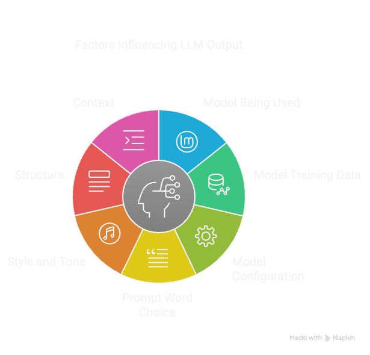

### Model Used
Model được sử dụng ảnh hưởng lớn đến chất lượng của kết quả trả về. Các mô hình khác nhau có kiến trúc, khả năng và phương pháp huấn luyện khác nhau, dẫn đến các phản hồi khác nhau ngay cả khi sử dụng cùng 1 prompt.

### Model training data
Tập dữ liệu dùng để huấn luyện mô hình là yếu tố quan trọng quyết định output của LLM. Mức độ đa dạng, chất lượng của dữ liệu ảnh hưởng đến nền tảng kiến thức của mô hình và khả năng tạo ra phản hồi chính xác và phù hợp. Các mô hình được huấn luyện trên tập dữ liệu lớFactors influencing LLM Output - visual selection.pngn và đa dạng thường cho kết quả tốt hơn cho các câu hỏi dạng tổng quát.

### Model configuration
Các cấu hình như "temperature" và "top-k sampling" có thể thay đổi đáng kể kết quả đầu ra. Ví dụ, temperature cao có thể tạo ra những phản hồi sáng tạo và đa dạng hơn, trong khi temperature thấp sẽ cho phản hồi tập trung và có cơ sở hơn. Cần tìm ra cấu hình phù hợp bằng cách điều chỉnh và đánh giá để kiểm soát hành vi của mô hình đáp ứng với nhu cầu.

### Prompt word choice
Từ ngữ được sử dụng trong prompt có thể định hướng phản hồi của mô hình theo nhiều hướng khác nhau. Việc dùng từ rõ ràng, chính xác giúp mô hình hiểu rõ yêu cầu, trong khi prompt mơ hồ có thể dẫn đến kết quả không nhất quán hoặc không phù hợp.

### Style and tone
Phong cách và giọng điệu của prompt cũng ảnh hưởng ít nhiều đến phản hồi. Prompt mang tính trang trọng hoặc thân mật sẽ khiến mô hình phản hồi theo phong cách tương tự. Điều quan trọng là cần giữ phong cách và giọng điệu nhất quán để phản hồi mạch lạc hơn.

### Structure
Cách tổ chức prompt — ảnh hưởng đến cách mô hình hiểu và phản hồi. Prompt có cấu trúc càng rõ ràng sẽ càng làm rõ kỳ vọng và từ đó nâng cao chất lượng phản hồi.

### Context
Cung cấp ngữ cảnh đặc biệt cần thiết để tạo ra phản hồi phù hợp, ngữ cảnh giúp mô hình hiểu rõ sắc thái và yêu cầu của người dùng. Càng cung cấp nhiều thông tin và chi tiết cuả context, mô hình càng dễ dàng tạo ra phản hồi chính xác, có ý nghĩa hơn.

### Lời kết
Hiểu rõ cách các yếu tố như model, training data, configs, context và cách viết prompt ảnh hưởng đến đầu ra sẽ giúp anh em khai thác tối đa sức mạnh của các mô hình ngôn ngữ lớn. Bằng cách áp dụng những nguyên tắc này, anh em có thể tạo ra prompt chất lượng hơn, cho phản hồi chính xác và giá trị hơn.

**Prompt engineering không chỉ là kỹ thuật – đó là nghệ thuật giao tiếp hiệu quả với AI.**

