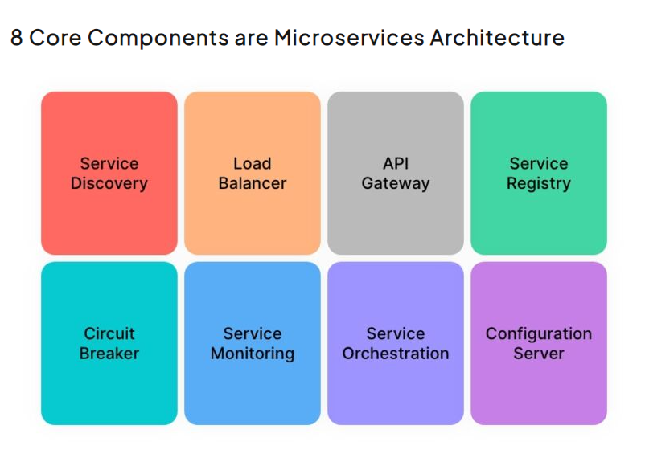

**Factory method** và các design pattern nói chung, chắc hẳn anh em đã nghe đến cả trăm ngàn lần rồi.
Nhưng liệu anh em đã bao giờ dừng lại và tự hỏi: “Các thư viện Java ứng dụng Factory Method như thế nào?” Đây sẽ là bài mở đầu trong một series thực chiến, nơi chúng ta sẽ cùng nhau khám phá cách mà các thư viện Java ứng dụng design pattern này, cũng như các biến thể thú vị của nó.
Hãy cùng tôi bắt đầu hành trình tìm hiểu và áp dụng những kiến thức này vào thực tế!

# I. Khái niệm và kiến trúc
Trích từ cuốn **Design patterns Elements of Reusable Object-Oriented Software**
> Provide an interface for creating families of related or dependent objects without
specifying their concrete classes.
>
> **GoF**

Intense của pattern này là tạo ra một interface cung cấp chức năng tạo một vài họ (families) của các đối tượng có liên quan đến nhau mà không cần chỉ đích danh họ đó là gì.

**Structure tổng quát**\

# II. Ví dụ
Cấu tạo của một chiếc bàn phím cơ bản bao gồm: case, bảng mạch, switch, keycap\
Nhưng bàn phím được chia theo nhiều loại khác nhau phục vụ các nhóm đối tượng khách hàng khác nhau.\
Bàn phím văn phòng cơ bản nhất là bàn phím

# III. Implementation trong Java
# IV. Implementation trong Spring
## java.net.URLStreamHandlerFactory#createURLStreamHandler()
Ví dụ đầu tiên là `URLStreamHandlerFactory` với phương thức `createURLStreamHandler` trả về một `URLStreamHandler` theo tham số đầu vào.

* `URLStreamHandlerFactory` tương ứng với `Creator`
* `FactoryMethod` tương ứng với `createURLStreamHandler`
* `URLStreamHandler` tương ứng với `Product`
* `DefaultFactory` tương ứng với `ConcreteCreator`.
* Cuối cùng các `ConcreateProduct` sẽ là subclass của `URLStreamHandler`, bao gồm các `Handler` nằm trong các package
  * `sun.net.www.protocol.file.Handler`
  * `sun.net.www.protocol.jar.Handler`
  * `sun.net.www.protocol.jrt.Handler`

Structure được vẽ lại tương ứng như sau

Có thể thấy `URLStreamHandlerFactory` ốp toàn bộ cấu trúc đã được định nghĩa của **GoF**, `Client` chỉ cần gọi phương thức trên và truyền vào protocol mong muốn.

## java.util.Calendar#getInstance()
Factory method còn có các biến thể khác khi `Creator` và `Product` được gộp vào làm một như trong ví dụ của `java.util.Calendar`.\
Thay vì nhờ vả anh bạn `Creator` như ví dụ trên, `Calendar` tự tạo instance mới bằng cách sử dụng một **static method** - `getInstance()`

`FactoryMethod()` chính là các hàm `getInstance(Locale)`, chấp nhận đầu vào là `locale`

* `locale.getUnicodeLocaleType` = `buddhist` trả về một instance mới của `BuddhistCalendar`
* `locale.getUnicodeLocaleType` = `japanese` trả về một instance mới của `JapaneseImperialCalendar`
* `locale.getUnicodeLocaleType` = `gregory` trả về một instance mới của `GregorianCalendar`

Như vậy, khi cần `Client` gọi phương thức `Calendar.getInstance()` với tham số locale thích hợp sẽ nhận được một sub class của `Calendar` tương ứng.

## java.text.NumberFormat#getInstance()
Ở ví dụ trên, `Creator` đã được thay thế bởi một **static method**, không dừng ở đấy, có một biến thể khác khi `Product` lúc này cũng không có các `ConcreteProduct` con, mà `factoryMethod()` chỉ đơn thuần trả về `Product` với các thuộc tính mang tính phân loại.\
Trường hợp của `NumberFormat`, nó hoàn toàn không khởi tạo class con, nhưng lại khởi tạo các class con về mặt ý nghĩa, vẫn là number format nhưng được dùng cho mục đích format theo dạng số, dạng phần trăm hay format tiền tệ, etc..

## java.nio.charset.CharSet#forName()
Nếu anh em chưa biết, ngoài vai trò ẩn đi logic khởi tạo, `Factory method` còn ứng dụng trong việc tối ưu tài nguyên sử dụng bằng cách trả về instance đã được khởi tạo thay vì khởi tạo instance mới.\
`CharSet.forName()` là một ví dụ của phương pháp này. Bằng cách sử dụng `cache`, CharSet sẽ trả về instance đã được tạo trước đó nếu tham số đầu vào phù hợp, nếu không CharSet sẽ tạo mới và lưu vào cache để tối ưu tài nguyên cho các lần request sau.

# III. Lời kết

Qua bài viết này, hy vọng anh em đã có một cái nhìn rõ ràng hơn về cách các thư viện Java sử dụng `Factory Method`, từ những ví dụ kinh điển như `URLStreamHandlerFactory`, `Calendar`, đến những biến thể độc đáo như `CharSet` hay `NumberFormat`.
Việc hiểu rõ và nắm vững những pattern này không chỉ giúp chúng ta viết code linh hoạt hơn mà còn mở ra nhiều cách tiếp cận sáng tạo trong quá trình phát triển phần mềm.
Hãy tiếp tục theo dõi series để cùng khám phá thêm nhiều điều thú vị về các design pattern trong các thư viện Java khác nhé

# IV. Tài liệu tham khảo
1. Refactoring Guru: [https://refactoring.guru/design-patterns](https://refactoring.guru/design-patterns)
2. Head first design pattern - O'Reilly
3. Design patterns Elements of Reusable Object-Oriented Software - GoF

-----

Nếu anh em cảm thấy bài viết hữu ích đừng ngần ngại click upvote cho bài viết, hoặc phát hiện ý nào chưa hợp lý hoặc cần giải thích thêm hãy comment cho tôi biết để cùng trao đổi nhé.
Anh em có thể tham khảo các bài viết khác của tôi tại [Blog cái nhân](https://nguyentaijs.github.io/) hoặc kết nối với tôi qua [Linkedin](https://www.linkedin.com/in/nguyentaijs)
