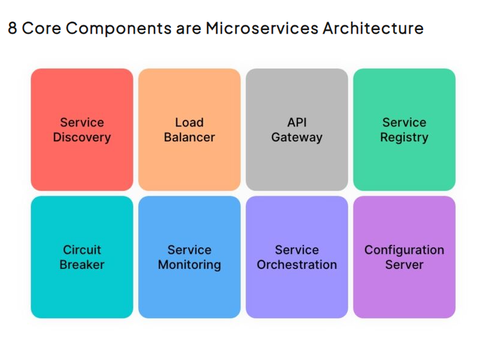

TODO
Chào mừng anh em trở lại với series [Design Pattern thực chiến](https://viblo.asia/s/design-pattern-thuc-chien-0gdJzpPnVz5) trong lập trình hướng đối tượng.
Trong bài viết lần này, chúng ta sẽ tiếp tục khám phá một trong những pattern cơ bản khác – **Prototype Pattern**.
Đây là một công cụ hữu ích giúp anh em tối ưu việc tạo ra các object mới mà không cần phải thiết lập lại toàn bộ từ đầu.
Hãy cùng nhau đi sâu vào khái niệm, cơ chế hoạt động, cũng như cách thức implement của Prototype Pattern trong Java, với những ví dụ cụ thể về Shallow Copy và Deep Copy nhé!

# I. Khái niệm và kiến trúc
## 1. Intense
Trích từ cuốn **Design patterns Elements of Reusable Object-Oriented Software**
> Separate the construction of a complex object from its representation so that the same
construction process can create different representations.
>
> **GoF**

Có thể rút ra 2 ý chính:

1. **Tách biệt** quá trình xây dựng một đối tượng phức tạp khỏi cách nó được thể hiện (representation), nghĩa là không bị ràng buộc bởi một cách biểu diễn cụ thể.
2. Quá trình xây dựng có thể tạo ra **các biểu diễn khác nhau của đối tượng**, nhờ vậy cùng một cách xây dựng có thể dùng để tạo nhiều loại đối tượng với cấu trúc khác nhau.

Nói cách khác, Builder Pattern cho phép linh hoạt trong việc tạo đối tượng mà không làm thay đổi quy trình tạo ra chúng.

**Structure tổng quát**


**Product**: là đối tượng phức tạp mà builder cần phải tạo ra. Thường constructor sẽ được set về `private`, đẩy trách nhiệm khởi tạo cho builder\
**Builder**: khai báo danh sách các phương thức để khởi tạo Product\
**ConcreteBuilder**: implement các phương thức đã được định nghĩa của **Builder**, và phương thức `GetResult()/build()` để trả về Product đã được tạo\
**Director**: thành phần optional, được dùng để mô tả cách Builder xây dựng Product. Cân nhắc sử dụng thành phần này khi quán trình khởi tạo instance chia thành nhiều bước.

## 2. Ứng dụng
### 2.1. Xây dựng đối tượng phức tạp có cần thực hiện nhiều bước hoặc có nhiều tham số
Khi đối tượng có nhiều tham số, việc sử dụng constructor thông thường dễ gây nhầm lẫn và khó hiểu.
Không có một tiêu chuẩn nào cụ thể cho số lượng param truyền vào trong 1 method nói chung và một constructor nói riêng,
nhưng best practice là giữ số param cho một method **nhỏ hơn 7** (theo tác giả Steve McConnell trong cuốn Code Complete).

Nhưng constructor của tôi cần nhiều hơn 7 params thì phải làm sao?\
Một trong những cách để giảm số params là tạo ra một object mới chứa tất cả các param có chung domain, hoặc sử dụng **builder pattern** để đơn giản hóa quá trình khởi tạo.
Chắc anh em đã từng thấy những method/constructor tương tự như đoạn code dưới đây (code thực tế của một người bạn trùng tên tôi vài năm trước :v)

```java
public Offer(OfferComponents offerComponents, String fileType, List<MultipartFile> listPoster,
		List<MultipartFile> subtitleFile, boolean useDrm, boolean useDrmOtt, boolean useChromecastDrm,
		boolean freeOtt, boolean useEncrypted, boolean useEncoded) {
}
```

Đoạn code trên khó maintain, khó đọc, vừa có khả năng tạo ra bug vì sai sót trong lúc set giá trị của 1 trong 6 anh `boolean params` xếp liền nhau.

### 2.2. Telescoping constructor
Đây là một phương pháp xử lý các tham số không bắt buộc. Theo đó, một class có nhiều constructor với số lượng tham số khác nhau.
Mỗi constructor sẽ gọi đến constructor khác với số lượng tham số ít hơn, và dần dần "bổ sung" các tham số cần thiết.
Đây là một trong các cách phổ biến để xử lý việc cung cấp các giá trị mặc định cho các tham số không bắt buộc.

Tuy nhiên nhược điểm của phương pháp này là khi số lượng các tham số tăng lên quá nhiều khiến cho việc maintain khó hiểu hơn, mở rộng khó khăn hơn, đồng thời vẫn không thể giải quyết được vấn đề về số lượng tham số truyền vào.

```java
// 2 params, others default
public Offer(OfferComponents offerComponents, String fileType) {
}

// 4 params, others default
public Offer(OfferComponents offerComponents, String fileType, List<MultipartFile> listPoster,
             List<MultipartFile> subtitleFile) {
}

// 7 params, others default
public Offer(OfferComponents offerComponents, String fileType, List<MultipartFile> listPoster,
             List<MultipartFile> subtitleFile, boolean useDrm, boolean useDrmOtt, boolean useChromecastDrm) {
}

// 10 params
public Offer(OfferComponents offerComponents, String fileType, List<MultipartFile> listPoster,
             List<MultipartFile> subtitleFile, boolean useDrm, boolean useDrmOtt, boolean useChromecastDrm,
             boolean freeOtt, boolean useEncrypted, boolean useEncoded) {
}
```
### 2.3. Tách biệt xử lý khởi tạo đối tượng với logic của đối tượng
Cũng ở ví dụ trên, ta có thể ước tính số dòng code dành riêng cho việc định nghĩa constructor đã chiếm kha khá không gian của code base.
Điều này ảnh hưởng đến quá trình maintain theo thời gian khi code base càng ngày càng to lên, đặc biệt gây khó khăn cho người sau khi phần lớn các dòng code chỉ dùng để khai báo constructor.

Việc Sử dụng builder pattern sẽ giúp ta tách biệt quá trình khởi tạo đối tượng khỏi logic của chương trình. Giúp code dễ dàng bảo trì và mở rộng hơn.

### 2.4. Đảm bảo tính bất biến (immutable)
Ứng dụng này đặc biệt hữu dụng trong việc xử lý multi thread, một khi instance được khởi tạo thành công, các thuộc tính hay trạng thái của instance sẽ không thể bị thay đổi.
Để đạt được mục tiêu này, thường các thuộc tính sẽ được định nghĩa với từ khóa `final`, các `constructor` và phương thức `setter` sẽ được giới hạn về `private`. Dưới đây là một ví dụ:

```java
public class Car {
    private final String color; // final để đảm bảo tính bất biến
    private final String transmission;

    private Car(CarBuilder builder) {
        this.color = builder.color;
        this.transmission = builder.transmission;
    }

    public String getColor() {
        return color;
    }

    public String getTransmission() {
        return transmission;
    }
}
```

# III. Thực hành implement trong Java

```java
public Circle(Circle target) {
    super(target);
    if (Objects.nonNull(target)) {
        this.radius = target.radius;
        System.out.println("Deep copy");
        this.color = target.color.clone();
    }
}
```

Trên thực tế, việc implement deep copy phức tạp hơn nhiều vì một class có thể có nhiều thuộc tính tham chiếu, mỗi thuộc tính tham chiếu lại có thể có nhiều thuộc tính con khác.

**Output**
```
Deep copy
They are EQUAL

After update clone Circle's RGB color to [200,255,255] ...
Original color = [255, 255, 255]
Clone color = [200, 255, 255]
They are not EQUAL
```
Full code anh em có thể tham khảo ở đây: [design-pattern-made-easy/prototype-deep-copy](https://github.com/nguyentaijs/design-pattern-made-easy/tree/main/prototype-deep-copy)

# III. Lời kết
TODO
Vậy là chúng ta đã cùng nhau tìm hiểu về Prototype Pattern – một giải pháp đơn giản nhưng hiệu quả trong việc tạo các đối tượng mới từ một prototype sẵn có.
Qua việc phân tích kỹ thuật Shallow Copy và Deep Copy, hy vọng anh em đã nắm rõ hơn về cách thức hoạt động và những điểm cần lưu ý khi triển khai pattern này trong thực tế.
Mỗi phương pháp đều có ưu và nhược điểm riêng, vì vậy, việc chọn lựa tùy thuộc vào ngữ cảnh và yêu cầu cụ thể của dự án.
Hãy áp dụng một cách thông minh để tránh những lỗi tiềm ẩn và đảm bảo hiệu suất tối ưu cho ứng dụng của anh em.\
Hẹn anh em ở các bài viết tiếp theo~

# IV. Tài liệu tham khảo
1. [Refactoring.guru](https://refactoring.guru/design-patterns)
2. Head first design pattern - O'Reilly
3. Design patterns Elements of Reusable Object-Oriented Software - GoF

-----

Nếu anh em cảm thấy bài viết hữu ích đừng ngần ngại click upvote cho bài viết, hoặc phát hiện ý nào chưa hợp lý hoặc cần giải thích thêm hãy comment cho tôi biết để cùng trao đổi nhé.
Anh em có thể tham khảo các bài viết khác của tôi tại [Blog cái nhân](https://nguyentaijs.github.io/) hoặc kết nối với tôi qua [Linkedin](https://www.linkedin.com/in/nguyentaijs)
