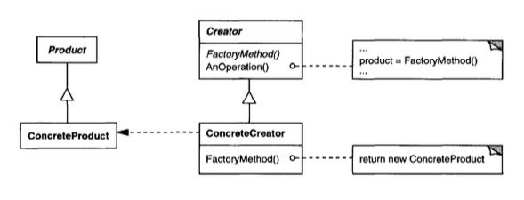
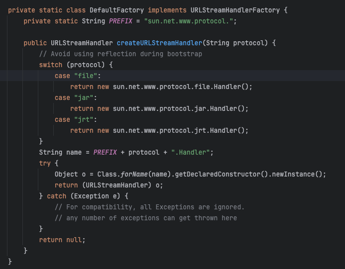
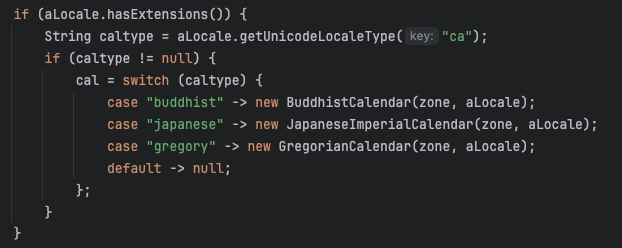
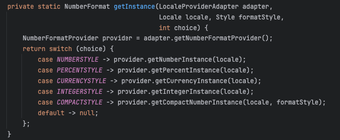
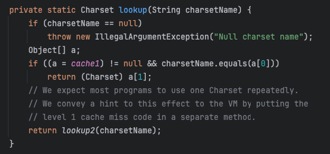

# I. Khái niệm và kiến trúc
Nguyên văn của các bác **GoF** trong cuốn **Design patterns Elements of Reusable Object-Oriented Software**
> Define an interface for creating an object, but let subclasses decide which class to instantiate.\
> Factory Method lets a class defer instantiation to subclasses.
>
> GoF

**Structure tổng quát**\

Như vậy có thể hiểu nôm na là đẩy vai trò khởi tạo cho các subclass.
Những tài liệu viết về định nghĩa và cấu trúc đã đủ nhiều rồi, anh em cùng tôi đi vào thực hành tìm hiểu các cách áp dụng pattern này trong các **Java library** nhé.

# II. Ứng dụng trên các thư viện Java
## java.net.URLStreamHandlerFactory#createURLStreamHandler()
Ví dụ đầu tiên là `URLStreamHandlerFactory` với phương thức `createURLStreamHandler` trả về một `URLStreamHandler` theo tham số đầu vào.

* `URLStreamHandlerFactory` tương ứng với `Creator`
* `FactoryMethod` tương ứng với `createURLStreamHandler`
* `URLStreamHandler` tương ứng với `Product`
* `DefaultFactory` tương ứng với `ConcreteCreator`.
* Cuối cùng các `ConcreateProduct` sẽ là subclass của `URLStreamHandler`, bao gồm các `Handler` nằm trong các package
  * `sun.net.www.protocol.file.Handler`
  * `sun.net.www.protocol.jar.Handler`
  * `sun.net.www.protocol.jrt.Handler`

Có thể thấy `URLStreamHandlerFactory` ốp toàn bộ cấu trúc đã được định nghĩa của **GoF**.

## java.util.Calendar#getInstance()
Factory method còn có các biến thể khác khi `Creator` và `Product` được gộp vào làm một như trong ví dụ của `java.util.Calendar`

`FactoryMethod()` chính là các hàm `getInstance(Locale)`, chấp nhận đầu vào là `locale`

* `locale.getUnicodeLocaleType` = `buddhist` trả về một instance mới của `BuddhistCalendar`
* `locale.getUnicodeLocaleType` = `japanese` trả về một instance mới của `JapaneseImperialCalendar`
* `locale.getUnicodeLocaleType` = `gregory` trả về một instance mới của `GregorianCalendar`

Đây vẫn được xem là một ví dụ về factory method vì việc khởi tạo các subclass được ẩn sau method `getInstance()`.

## java.text.NumberFormat#getInstance()
Một biến thể khác khi `Product` cũng không có các `ConcreteProduct` con, mà chỉ đơn thuần trả về chính nó với một số thuộc tính khác biệt.\
`NumberFormat` hoàn toàn không khởi tạo class con, nhưng lại khởi tạo các class con về mặt ý nghĩa, `client` có thể khởi tạo `NumberFormat` dạng số, phần trăm, tiền tệ, etc..

## java.nio.charset.CharSet#forName()
Như anh em đã biết, ngoài vai trò ẩn đi logic khởi tạo, `Factory method` còn có vai trò tối ưu tài nguyên sử dụng bằng trả về instance đã được khởi tạo thay vì khởi tạo instance mới.\
`CharSet.forName()` là một ví dụ của phương pháp này. Bằng cách sử dụng `cache`, CharSet sẽ trả về instance đã được tạo trước đó nếu tham số đầu vào phù hợp, nếu không CharSet sẽ tạo mới và lưu vào cache để tối ưu tài nguyên cho các lần request sau.

